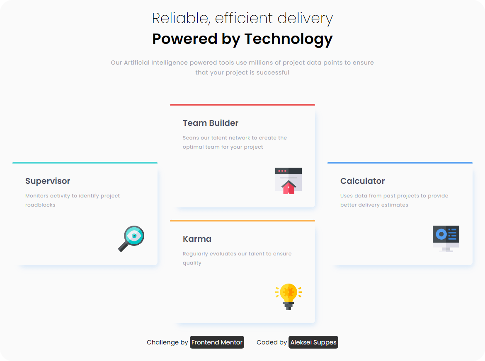

# Frontend Mentor - Four card feature section solution

This is a solution to the [Four card feature section challenge on Frontend Mentor](https://www.frontendmentor.io/challenges/four-card-feature-section-weK1eFYK). Frontend Mentor challenges help you improve your coding skills by building realistic projects. 

## Table of contents

- [Overview](#overview)
  - [The challenge](#the-challenge)
  - [Screenshot](#screenshot)
  - [Links](#links)
- [My process](#my-process)
  - [Built with](#built-with)
  - [What I learned](#what-i-learned)
  - [Useful resources](#useful-resources)
- [Author](#author)

## Overview

### The challenge

Users should be able to:

- View the optimal layout depending on their device's screen size
- See hover states for interactive elements

### Screenshot



### Links

- Solution URL: [Frontend Mentor Solution](https://www.frontendmentor.io/solutions/four-card-feature-section-ZG4EGvmS0m)
- Live Site URL: [GitHub Pages](https://lexsupdev.github.io/Four-card-feature-section/)

## My process

### Built with

- Semantic HTML5 markup
- CSS custom properties
- Flexbox
- SCSS
- Grid 

### What I learned
This is my first touch with Grid system

```css
.featureList {
    display: grid;
    grid-template-columns: repeat(3, 1fr);
    column-gap: 30px;
}

```
### Useful resources

- [https://doka.guide/css/grid-guide/](https://doka.guide/css/grid-guide/) - This helped me to understand grid system.

## Author

- Frontend Mentor - [@lexsupdev](https://www.frontendmentor.io/profile/LexSupDev)

